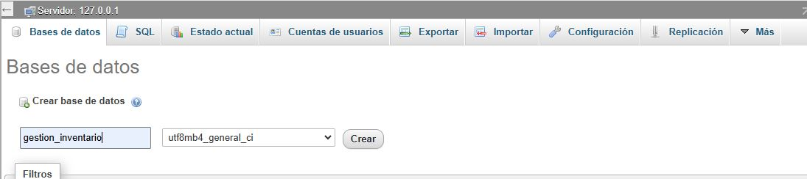
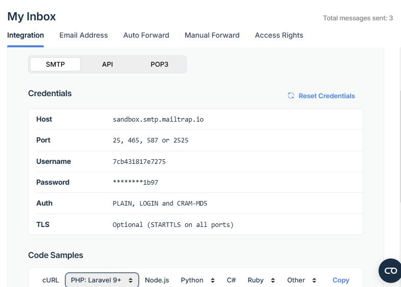
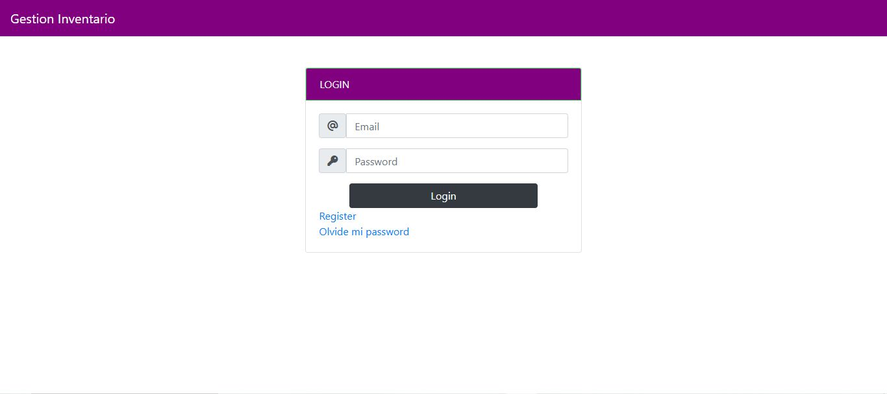
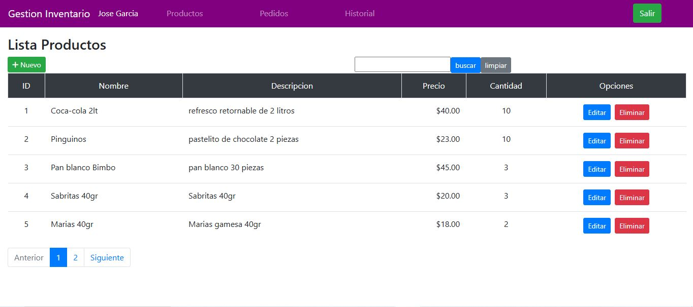
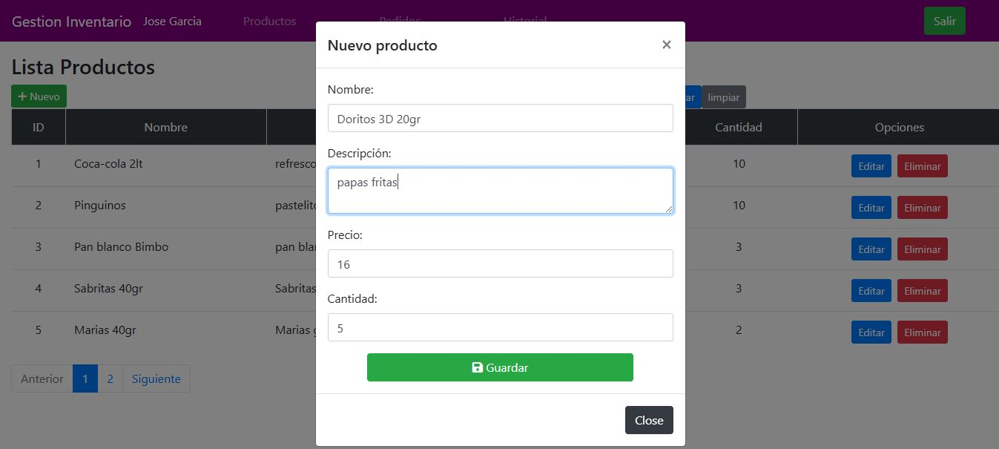
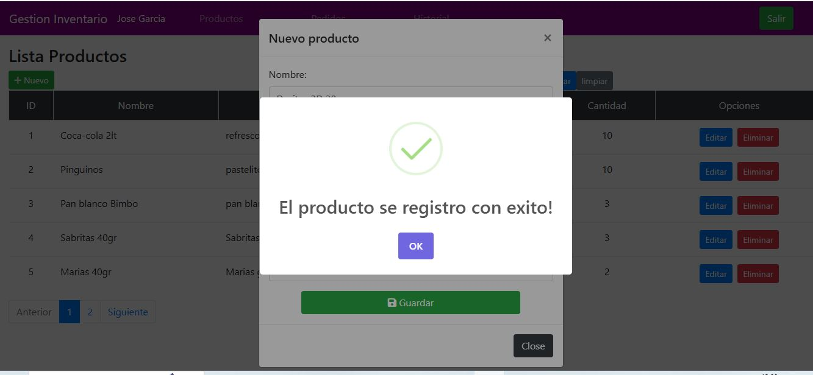
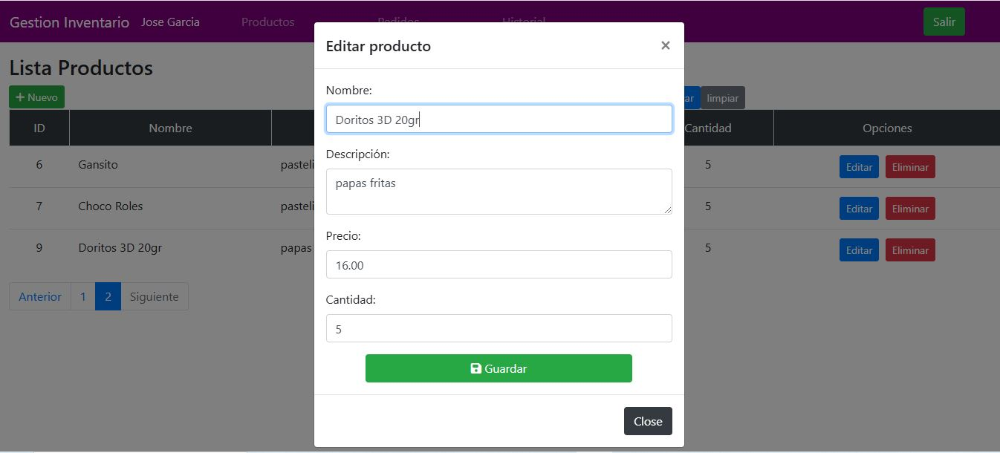
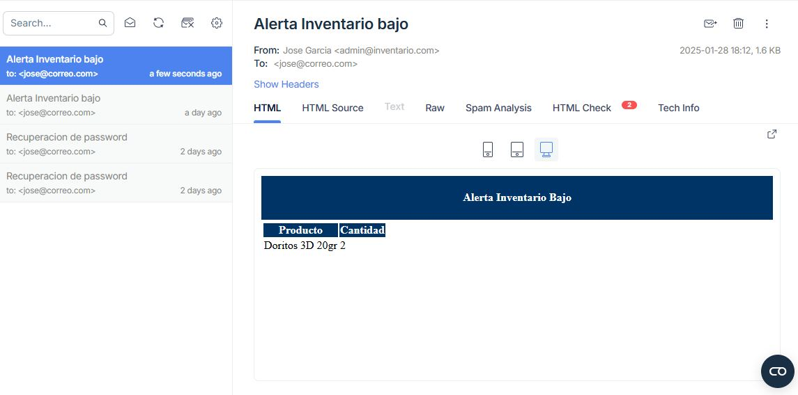
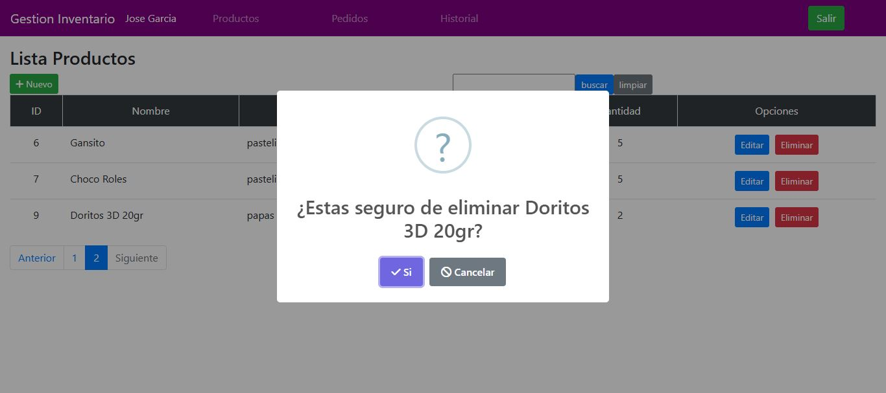

   

      
   

    
    
    <h1 width="200">Desarrollador Fullstack</h1>
   
La siguiente es una prueba para evaluar a aspectos técnicos de los candidatos a desarrollador Fullstack <b>Senior</b>.

    

## Objetivo de la Prueba

El objetivo de esta prueba es evaluar la capacidad del candidato para diseñar e implementar un sistema avanzado, con énfasis en la escalabilidad, seguridad y optimización. Se espera que el candidato pueda trabajar con **Laravel** para construir un backend robusto y seguro, así como un frontend funcional con **React Native** (u otra tecnología de su elección). Además, deberá implementar estrategias avanzadas de manejo de datos y pruebas automatizadas.

---

## Requisitos de Desarrollo

### Funcionalidades Principales

1. **Autenticación y Roles de Usuario**

   - Implementar un sistema de autenticación utilizando Laravel Sanctum.
   - Crear roles configurables (e.g., Admin, Usuario Básico).
   - Proteger rutas de la API según los roles de usuario.
   - Implementar recuperación de contraseña mediante tokens y correo electrónico.

2. **Gestión de Productos con Control de Inventarios Avanzado**

   - CRUD (crear, leer, actualizar y eliminar) para productos mediante la API.
   - Validar los siguientes campos:
     - **Nombre**: Texto corto, obligatorio.
     - **Descripción**: Texto largo, opcional.
     - **Precio**: Decimal, obligatorio.
     - **Cantidad en Inventario**: Número entero, obligatorio (mínimo de 0).
   - Funcionalidades avanzadas:
     - **Alertas de inventario bajo**: Enviar notificaciones por correo electrónico cuando la cantidad de inventario de un producto sea menor a un umbral definido.
     - **Historial de movimientos**: Registrar aumentos y disminuciones de inventario, incluyendo:
       - Cantidad modificada.
       - Fecha y hora de la modificación.
       - Usuario que realizó la acción.

3. **Gestión de Pedidos**

   - Crear, leer y listar pedidos asociados a los productos.
   - Cada pedido debe incluir:
     - Productos comprados (con cantidades).
     - Usuario que realizó el pedido.
     - Estado del pedido (Pendiente, Procesado, Completado, Cancelado).
     - Fecha de creación y última actualización.
   - Enviar un correo electrónico de confirmación al usuario cuando el pedido cambie de estado.
   - Aumentar la cantidad de productos en inventario cuando se complete un pedido.

4. **Frontend con React Native**

   - Crear una interfaz de usuario en React Native que permita:
     - Iniciar sesión y gestionar el token de autenticación.
     - Visualizar el listado de productos con paginación optimizada.
     - Buscar productos por nombre o descripción.
     - Poder ordenar o filtrar los productos con los siguientes criterios:
         - Por precio.
         - Por cantidad en inventario.
         - Por rango de precios.
     - Crear, editar y eliminar productos.
     - Gestionar inventarios con historial de movimientos.
     - Consultar y gestionar pedidos, incluyendo su cambio de estado.
   - Gestionar el estado de la aplicación utilizando **MobX-State-Tree** o **Redux**.
   - En caso de no utilizar React Native, se puede emplear otra tecnología o método para el frontend, explicando en el archivo `README.md` los motivos de la elección.

---

## Restricciones

- No está permitido el uso de paquetes externos para las funcionalidades principales descritas, como autenticación, CRUD o gestión de roles. Se deben utilizar exclusivamente las herramientas nativas de Laravel y el framework elegido.
- **Excepciones:**
  - Uso de librerías externas para la navegación en el frontend.
  - Se debe utilizar **Mailtrap** para las notificaciones por correo electrónico.

---

## Tecnologías y Herramientas

- **Backend:** Laravel (versión 11).
- **Frontend:** React Native (preferentemente) o alguna otra tecnología elegida por el candidato.
- **Base de Datos:** MySQL o PostgreSQL (a elección del candidato).
- **Autenticación:** Laravel Sanctum.
- **Control de Versiones:** Git.
- **Servicio de Correos:** Mailtrap.

---

## Entregables Requeridos

1. **Repositorio de Código:**

   - Subir el código fuente al repositorio indicado en las intrucciones.

2. **Archivo `README.md`:**

   - Instrucciones claras para configurar y ejecutar el proyecto localmente, tanto para el backend como para el frontend.
   - Descripción de las decisiones técnicas tomadas durante el desarrollo.
   - Lista de las tecnologías utilizadas.
   - Instrucciones para configurar Mailtrap en el archivo `.env`.

3. **Pruebas Automatizadas:**

   - Implementar pruebas unitarias y funcionales para el backend y/o frontend.

4. **Demostraciones Visuales:**

   - Capturas de pantalla o videos que muestren:
     - Uso del sistema de autenticación y gestión de roles.
     - Gestión avanzada de inventarios.
     - CRUD de productos.
     - Creación y gestión de pedidos.
     - Envío de notificaciones por correo electrónico mediante Mailtrap.

---

## Criterios de Evaluación

1. **Funcionalidad:**
   - Verificar que todas las funcionalidades descritas estén implementadas y funcionando correctamente.

2. **Diseño:**
   - Interfaz simple, funcional y atractiva utilizando Tailwind CSS.

3. **Calidad del Código:**
   - Evaluar el uso de buenas prácticas en Laravel y React Native (o la tecnología elegida).
   - Organización del código y modularidad.

4. **Calidad del control de versiones:**

   - Uso de git flow para la creación los commits del proyecto.
   - Títulos descriptivos para los commits del proyecto.
   - Uso de las diferentes funcionalidades de gitflow para todas las carácteriticas del proyecto según se necesite.

5. **Documentación:**
   - Revisar que el archivo `README.md` sea claro, completo y bien estructurado.

6. **Extras Opcionales:**
   - Uso de Docker para facilitar la configuración y despliegue del proyecto (En caso de implementar docker incluir las instrucciones necesarias para su ejecución en el archivo `README.md` del proyecto).
   - Implementación de cacheo para optimizar la API.

---

## Tiempo Estimado para la Prueba

Se estima que el desarrollo de esta prueba puede tomar alrededor de **3 días**. Para mayor flexibilidad, se otorgará un plazo de **7 días hábiles** para su entrega, permitiendo al candidato administrar su tiempo de manera eficiente.

---

## Proceso de Entrega

1. El candidato debe realizar un fork de este repositorio (https://github.com/snowworm-mx/prueba-senior).
2. Una vez completada la prueba, debe realizar un pull request (PR) al repositorio original . 
   * El PR debe incluir:
      * Un título descriptivo (e.g., "Implementación de funcionalidades de gestión de inventario").
      * Una descripción detallada de las funcionalidades implementadas y cualquier consideración técnica adicional.

---

**¡Éxito!**

---

***Implementación de funcionalidades de gestión de inventario***

**Lista de Técnologías utilizadas**
   * Laravel, php, mysql, laravel sanctum
   * vue3, pinia, pinia persisted api, bootstrap

***Instalación y configuración del Sistema***

**Creación de la Base de datos**

instalar xampp o laragon para tener un servidor de base de datos.
dirigirnos al navegador a la siguiente url 127.0.0.1/phpmyadmin
de ahí crear un abse de datos de nombre "gestion_inventario"

   

      
   

 

**Instalación de las librerias**

El sistema cuenta de 2 partes la parte backend y la parte frontend
para configurar el backend nos dirigimos a la carapeta backend-gestion-inventario y ejecutamos el comando "composer install" para descargar todas las librerias: 
 
composer install

 
Buscamos el archivo .env.example y lo renombramos por .env 
dentro del archivo .env configuramos las lineas de la base de datos
  
DB_CONNECTION=mysql 
DB_HOST=127.0.0.1 
DB_PORT=3306 
DB_DATABASE=gestion_inventario 
DB_USERNAME=root 
DB_PASSWORD= 
 
Ademas agragremos las sisguientes lineas para la configuracion de laravel sanctum:
  
SESSION_DRIVER=cookie 
SESSION_DOMAIN=localhost 
SANCTUM_STATEFUL_DOMAINS=http://localhost:5173 
 

**Generamos la key de la aplicacion**

Para generar la clave de la aplicación tenemos que ejecutar el sisguiente comando:
php artisan key:generate
 

**Generacion de las tables de la aplicacion**

Para generar las tablas de la aplicación ejecutamos el comando:
php artisan migrate

**Precargar datos en la DB**

Para generar los datos de prueba en la base de datos ejecutamos el siguiente comando:
php artisan db:seed

 
Este comando nos va a llenar la tabla de productos 
Tambien nos va a generar un usuario cuyo usuario es : jose@correo.com y un password:
12345678
 
 

**Configuración de Mailtrap**
 
Para configurar Mailtrap en laravel, necesitamos crear una cuenta en https://mailtrapio/. Un vez creada la cuenta nos dirigimos a Inboxes>My Inbox y nos aparecera la siguiente información:

   

      
   

 
De ahi nos dirigimos al archivo .env dentro de la carpeta backend-gestion-inventario
y reemplazamos estas lineas:
  
MAIL_MAILER=smtp 
MAIL_HOST=sandbox.smtp.mailtrap.io 
MAIL_PORT=2525 
MAIL_USERNAME=7cb431817e7275 
MAIL_PASSWORD=********1b97 
 
Y ya tendremos listo nuestra configuración de Mailtrap.
  
Por ultimo corremos el comando: php artisan serve
para levamntar el servidor

**Configuracion Frontend**

Nos dirigimos a la carapeta frontend-gestion-inventario y ejecutamos el siguiente comando: npm install
 
Para correr el frontend ejecutamos el comando: npm run dev

---

***Autenticación del Sistema***

Ingresamos a l sistema con el usuario y password generados

   

      
   

 

***CRUD de Productos***

Una vez ingresado al sistema nos va a redirigir a la siguiente pagina, que es el listado de productos.

   

      
   

    
   Para agregar un nuevo producto presionamos el botón Nuevo, que nos abrira una ventana modal para reguistrar el nuevo producto.
   

      
   

    
   

      
   

    
   Una vez que terminemos de agregar los adtaos del producto presionamos el botn guarar para su registro.
   

      
   

    
   Para editar el producto presionamos el boton editar, el cual nos abrira una ventana modal similar a la de Nuevo producto y de igual manera presionamos el bton guardar para modificarlo.
   

      
   

    
   Si la casntidad de producto es igual o menor a 3 nos enviara un correo electronico de alerta indicandonos el bajo inventario.
   

      
   

    
   Por ultimo para eliminar el producto presionamos el boton eliminar, nos abrira un confirm y seleccionamos aceptar.
   

      
   

    

